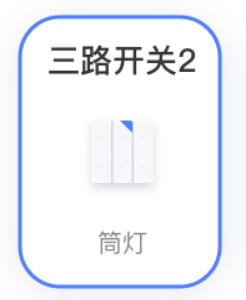
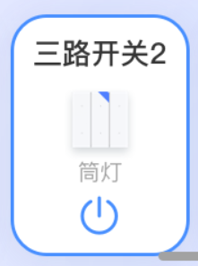

# 设备卡片

## 属性

| 参数 name   | 类型    | 必传  | 默认值 | 描述           |
| ----------- | ------- | ----- | ------ |--------------|
| deviceInfo  | Object  | true  | -      | 设备信息         |
| select      | boolean | false | false  | 是否控制选中       |
| showControl | boolean | false | false  | 是否有控制功能      |
| editMode | boolean | false | false  | 是否处于长按选中模式   |

## 事件

| 事件 name     | 类型 | 必传  | 描述                                      |
| ------------- | ---- | ----- | ----------------------------------------- |
| bind:cardTap  | -    | false | 点击卡片，返回参数传进来的 deviceInfo     |
| bind:powerTap | -    | false | 点击控制按钮，返回参数传进来的 deviceInfo |

---

没有控制功能：

有控制功能：

