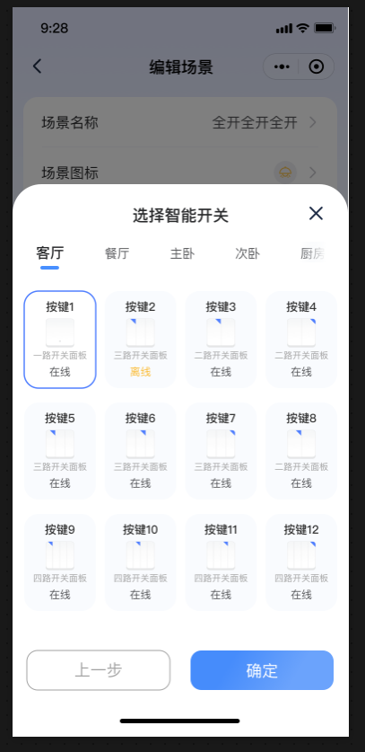
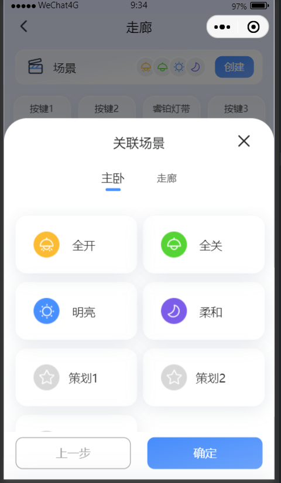

# 选择子设备或者场景卡片弹窗组件

## 简介
设备卡片弹窗

场景卡片弹窗

## 属性

| 参数 name     | 类型                                                | 必传    | 默认值      | 描述                                |
|-------------|---------------------------------------------------|-------|----------|-----------------------------------|
| show        | boolean                                           | true  | -        | 是否显示弹窗                            |
| title       | string                                            | false | ''       | 弹窗标题                              |
| list        | Array<Device.DeviceItem>或者Array<Device.SceneItem> | false | []       | 展示的数据列表                           |
| selectList  | Array<string>                                     | false | []       | 选中项的Id集合                          |
| cardType    | string                                            | false | 'device' | 卡片类型，设备卡片：'device'  场景卡片： 'scene' |
| showCancel  | boolean                                           | false | true     | 是否显示取消按钮                          |
| cancelText  | string                                            | false | '取消'     | 取消按钮文案                            |
| showConfirm | boolean                                           | false | true     | 是否显示确认按钮                          |
| confirmText | string                                            | false | '确认'     | 确认按钮文案                            |

## 事件

| 事件              | 类型  | 必传    | 描述              |
|-----------------|-----|-------|-----------------|
| bind:close      | -   | false | 关闭弹窗            |
| bind:confirm    | -   | false | 点击确认按钮          |
| bind:cancel     | -   | false | 点击取消按钮          |
| bind:offlineTap | -   | false | 设备弹窗有效，点击离线设备卡片 |

